# Dark Factory Architecture

_Last updated: 2026-06-25_

## 1. Scope and source of truth

This document describes the **Dark Factory** platform as it exists in the monorepo: six backend subservices, two frontends, shared infrastructure, and the main runtime flows.

**Primary sources used for this document**:
- `README.md`
- `specs/004-keycloak-iam-migration/plan.md`
- `infra/docker-compose.yml`
- `infra/docker-compose.override.yml`
- Representative service entrypoints and module trees under `services/**/src`

> Note: some older per-service READMEs still describe legacy local-JWT flows. The architecture below follows the current runtime defined by compose + spec + current source: **Keycloak is the active identity provider in runtime**, while `AUTH_MODE=local` remains for automated tests.

---

## Original vision vs. implementation status

This section maps the original high-level architecture and workflow described in the early Dark Factory prompt to the current monorepo implementation.

### Status legend

| Symbol | Meaning |
|--------|---------|
| ✅ | Implemented and operational |
| ⚠️ | Partially implemented — core present, gaps remain |
| ❌ | Not implemented |
| 🆕 | Implemented, but not part of the original vision |

### Workflow steps

| # | Step | Status | Current implementation |
|---|------|--------|------------------------|
| 1 | **Prompt Processing** — receive, analyze, clarify, and enhance a user prompt | ✅ | `user-input-manager` (Prompt Studio) performs iterative session-based refinement with LLM support before plan generation. |
| 2 | **Planning** — pass enhanced spec to Speckit; generate implementation plan with requirements, architecture, and milestones | ✅ | Planning is implemented in `user-input-manager` via `PlanningService`, which generates Epic → Stories → Tasks and stores agent configuration. |
| 3 | **Task Decomposition** — decompose plan into discrete tasks; register in Ticket Manager | ✅ | Confirmed plans are converted into `ticket-manager` entities over HTTP. |
| 4 | **Development Execution** — human operator initiates the cycle; Orchestrator monitors backlog | ✅ | Operators trigger orchestration jobs in `orchestrator`; `JobWorker` processes them asynchronously. |
| 5 | **Task Assignment** — Orchestrator analyzes scope, requirements, dependencies, and complexity, then assigns the most appropriate agent | ✅ | `OrchestratorService` uses FSM transitions, project memory, dependency state, and LLM-guided decisions to assign work back to Ticket Manager. |
| 6 | **Agent Collaboration** — agents collaborate through the Brainstorm MCP communication layer | ⚠️ | `agent-dispatcher` has `BrainstormCoordinator` for structured multi-round collaboration, but direct peer-to-peer messaging and shared working memory are not yet implemented. |
| 7 | **Iterative Development** — agents implement, test, validate, debug, document, and review | ✅ | `agent-dispatcher` launches agents in `claude_code` or `api` mode, parses results, and reports progress/outcomes. |
| 8 | **Completion Criteria** — the cycle continues until every ticket reaches Done | ✅ | `ticket-manager` FSM and event history track completion; `Done` is a terminal state. |

### Core components

| Original component | Status | Current implementation |
|-------------------|--------|------------------------|
| **Prompt Enhancement Layer** | ✅ | Delivered by `user-input-manager` as Prompt Studio with iterative prompt refinement. |
| **Speckit** | ✅ | Planning capabilities are embedded in `user-input-manager` instead of a standalone runtime service. |
| **Ticket Manager** | ✅ | `ticket-manager` is the system of record for projects, tickets, assignments, progress, and event history. |
| **Orchestrator** | ✅ | `orchestrator` coordinates workflow decisions, FSM transitions, audit trail, and distillation triggers. |
| **Specialized Agents** | ⚠️ | Agent execution is implemented, but agents are transient CLI/API-invoked processes rather than persistent deployable services. |
| **Brainstorm MCP** | ⚠️ | `agent-tools` provides MCP-style read tooling and `agent-dispatcher` coordinates brainstorm loops, but open inter-agent messaging is missing. |

### Components added during implementation

| Component | Status | Role |
|-----------|--------|------|
| 🆕 **Context Distiller** | Implemented | Compresses project history and ADRs into durable memory used by orchestration and agent runs. |
| 🆕 **Identity & Access Management** | Implemented | Keycloak + `oauth2-proxy` provide centralized runtime authentication and authorization. |
| 🆕 **Frontend applications** | Implemented | `uim-frontend` and `tm-frontend` provide browser UIs for prompt refinement and ticket management. |
| 🆕 **Edge proxy & routing** | Implemented | `nginx` handles browser ingress and routes traffic through the auth layer. |
| 🆕 **Agent Tools** | Implemented | MCP-compatible helper service for read-only git and memory access. |

### Remaining gaps from the original vision

- **Brainstorm MCP**: collaboration is still coordinator-driven; agents do not yet exchange messages peer-to-peer or share a live working memory.
- **Specialized Agents**: agents are not yet long-running services with a registry and capability discovery API.
- **Dynamic specialization**: agent selection is still mostly driven by static role definitions and LLM reasoning rather than a formal capability index.

---

## 2. Executive summary

Dark Factory is an **AI-assisted software delivery platform** built as a Docker Compose monorepo. Users refine work items in **Prompt Studio** (`user-input-manager`), persist and manage tickets in **Ticket Manager** (`ticket-manager`), advance work through a workflow engine in **Orchestrator** (`orchestrator`), compress project context in **Context Distiller** (`context-distiller`), expose agent-side retrieval tools via **Agent Tools** (`agent-tools`), and execute specialist coding/review agents via **Agent Dispatcher** (`agent-dispatcher`).

### Service catalog

| Service | Internal URL | Primary responsibility | Storage |
|---|---|---|---|
| `user-input-manager` | `http://user-input-manager:8000` | Prompt refinement, planning, ticket creation kickoff | PostgreSQL |
| `ticket-manager` | `http://ticket-manager:8000` | Projects, tickets, assignments, events, progress, resource accounting | PostgreSQL |
| `orchestrator` | `http://orchestrator:8000` | FSM-based ticket orchestration and audit trail | PostgreSQL + MongoDB |
| `context-distiller` | `http://context-distiller:8000` | Project memory, ADRs, agent config, distillation jobs | PostgreSQL + MongoDB |
| `agent-tools` | `http://agent-tools:8000` | MCP tools for code and memory access | none |
| `agent-dispatcher` | `http://agent-dispatcher:8000` | Agent execution, brainstorm coordination, result reporting | PostgreSQL |

### Shared infrastructure

| Component | Role |
|---|---|
| `nginx` | Browser entrypoint and reverse proxy |
| `oauth2-proxy` | Bearer-token validation at the edge |
| `keycloak` | Identity provider for runtime users and service accounts |
| `postgres` | Per-service relational databases |
| `mongo` | Document storage for Orchestrator and Context Distiller |
| OpenAI-compatible LLM | Prompt refinement, planning, orchestration, distillation, agent API mode |

---

## 3. System context diagrams

### 3.1 C4 Level 1 — system context

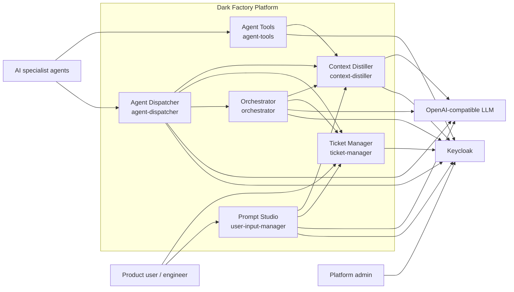

### 3.2 C4 Level 2 — container/runtime view

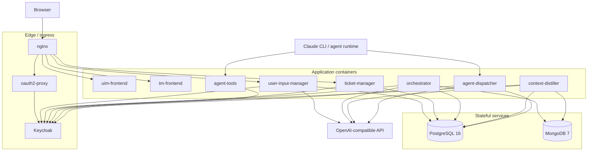

### 3.3 Internal service relationship map

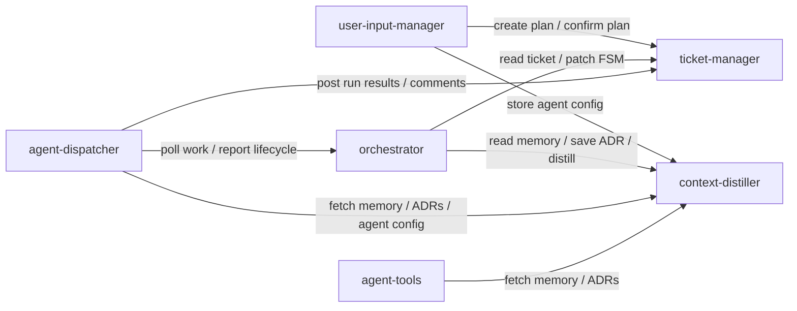

---

## 4. Data stores and ownership

### 4.1 Persistence ownership

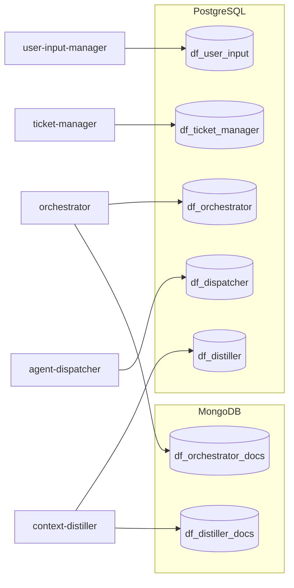

### 4.2 High-level domain data map

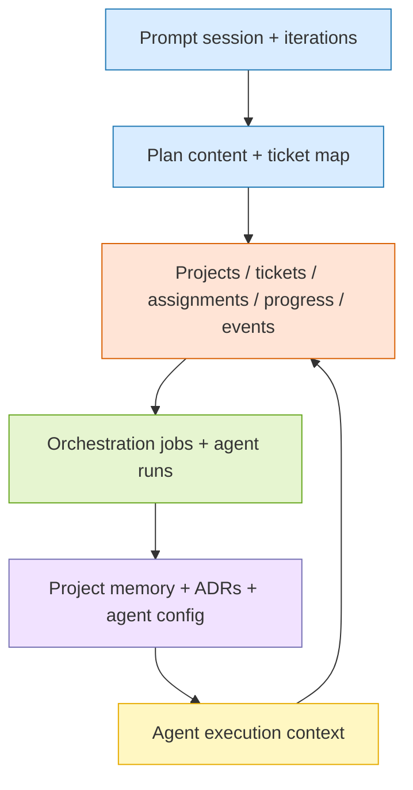

---

## 5. Core runtime flows

## 5.1 Prompt refinement and planning flow

This flow starts in Prompt Studio and ends with a plan persisted locally, then confirmed into Ticket Manager and mirrored into Context Distiller as agent configuration.

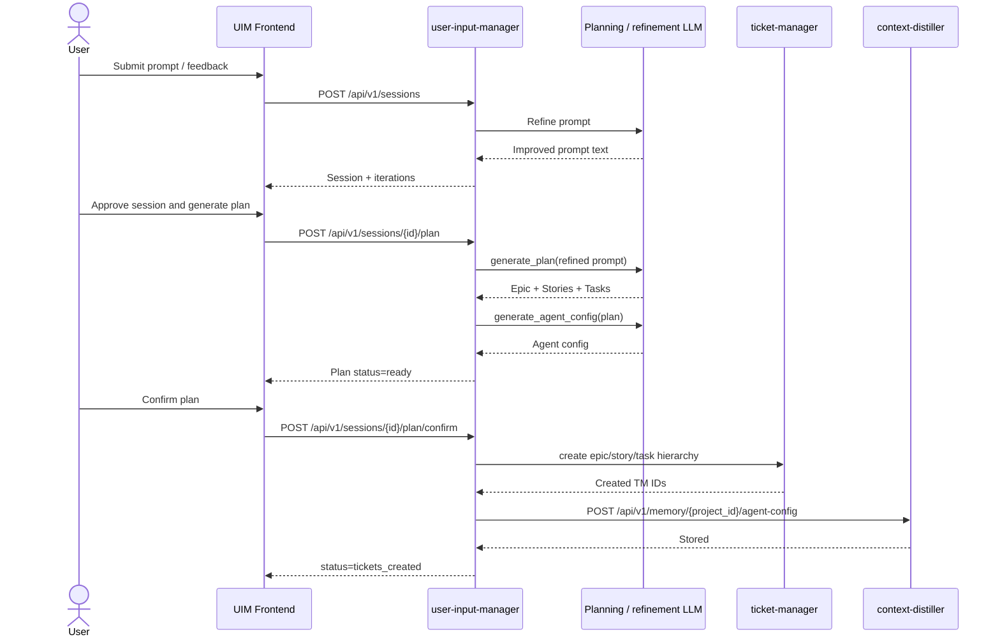

## 5.2 Orchestration / FSM flow

This is the orchestration cycle for advancing a ticket based on current state, dependencies, project memory, and LLM guidance.

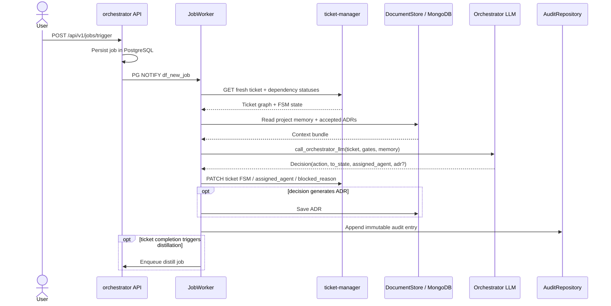

## 5.3 Memory distillation flow

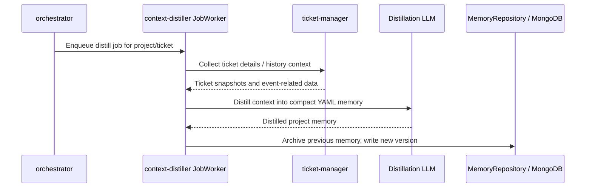

## 5.4 Agent execution flow

This is the primary execution loop for non-brainstorm tickets.

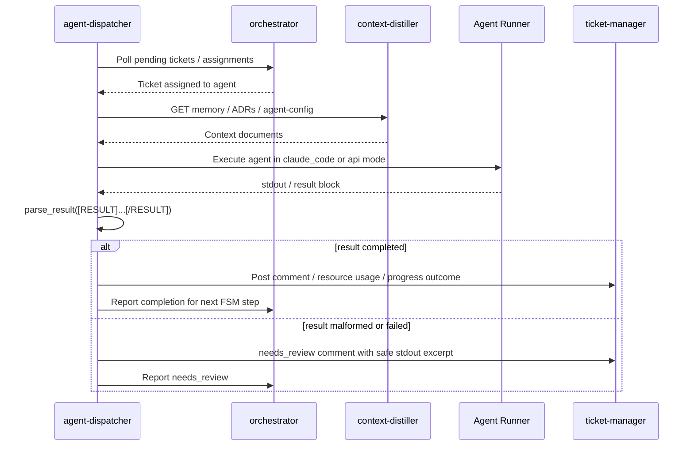

## 5.5 Architecture-review brainstorm flow

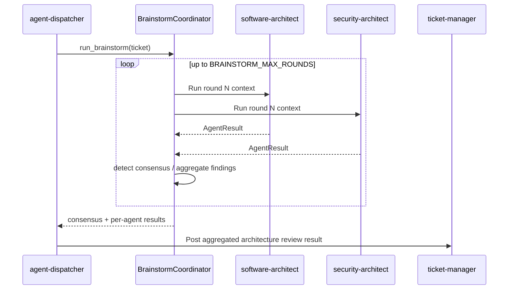

---

## 6. C4 Level 3 / service component architecture

## 6.1 `user-input-manager` components

**Purpose**: Prompt Studio for iterative prompt refinement, plan generation, and plan confirmation.

**Primary internal components**:
- API routers: `sessions.py`, `planning.py`, `ticket_manager.py`, `orchestrator.py`
- Services: `SessionService`, `PlanningService`
- LLM adapters: `services/llm/*`
- Ticket Manager clients: `services/ticket_manager/*`
- Persistence: `SessionRepository`, `PlanRepository`, `IterationRepository`

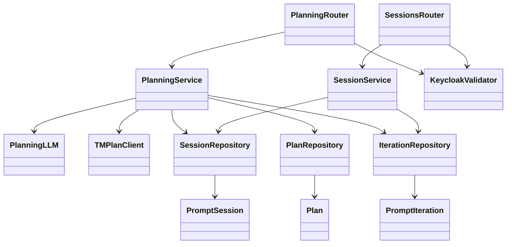

## 6.2 `ticket-manager` components

**Purpose**: System of record for projects, tickets, assignments, transitions, progress, audit-style events, and resource usage.

**Primary internal components**:
- API routers under `backend/src/api/v1/`
- Services: `TicketService`, `AssignmentService`, `WorkflowService`, `TransitionService`, `ProgressService`, `ResourceService`, `AdminService`, `EventService`
- Models under `backend/src/models/`

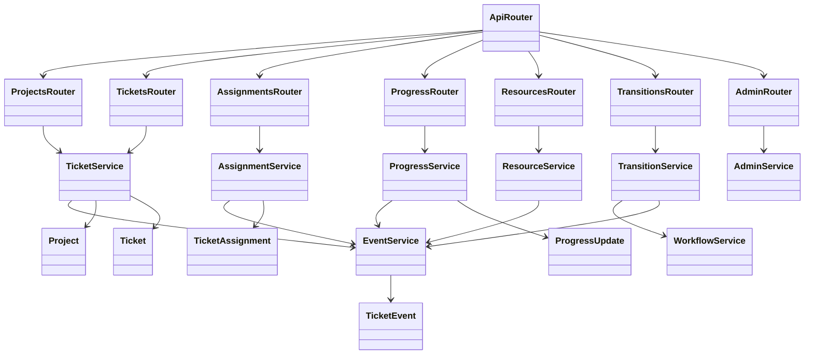

## 6.3 `orchestrator` components

**Purpose**: Ticket FSM engine and orchestration job runner.

**Primary internal components**:
- API routers: `jobs.py`, `audit.py`, `memory.py`
- Worker: `JobWorker`
- Services: `OrchestratorService`, `DistillerService`, `DocumentStore`, `TicketManagerClient`, `call_orchestrator_llm`, `fsm.engine`
- Repositories: `JobRepository`, `AuditRepository`

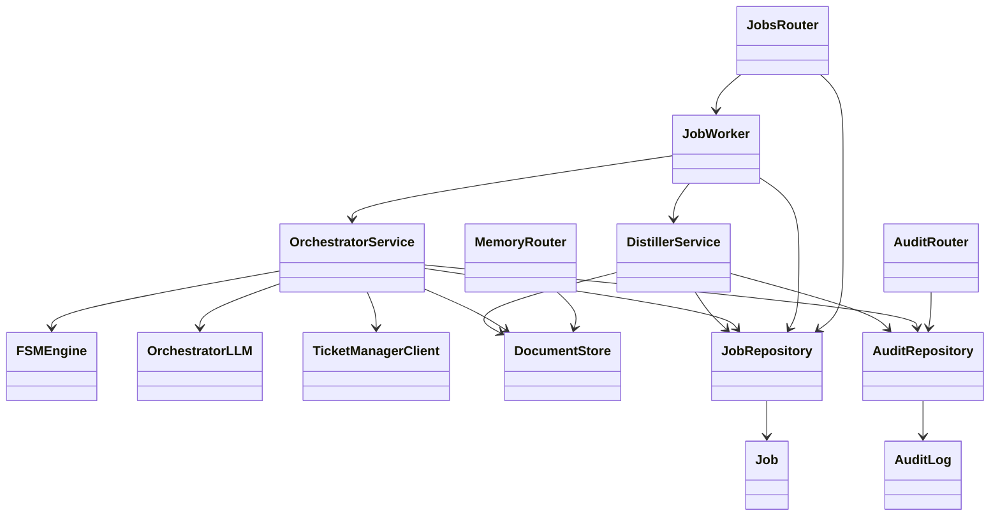

## 6.4 `context-distiller` components

**Purpose**: Project memory compression and retrieval service.

**Primary internal components**:
- API routers: `distill.py`, `memory.py`
- Worker: `JobWorker`
- Services: `DataCollector`, `distill`, `TMClient`
- Repositories: `JobRepository`, `MemoryRepository`

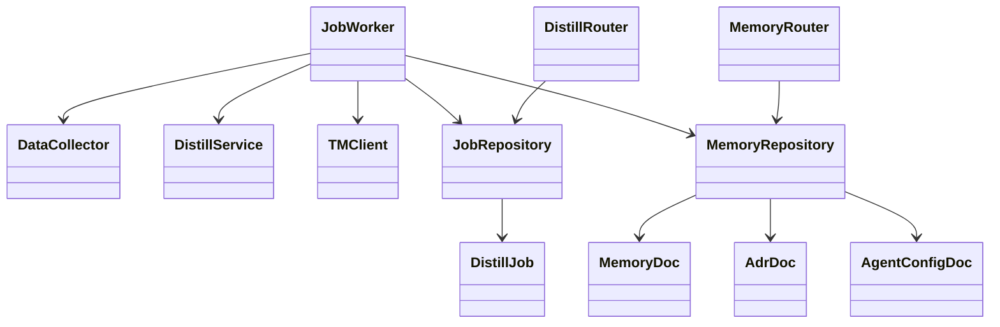

## 6.5 `agent-tools` components

**Purpose**: MCP-accessible helper tools for agents.

**Primary internal components**:
- Entry point: `server.py` with `FastMCP`
- Tool groups: `tools/document_store.py`, `tools/git_read.py`
- Utilities: `utils/envelope.py`, `utils/git_utils.py`
- Auth/service client: `core/auth_adapter.py`, `core/keycloak_client.py`

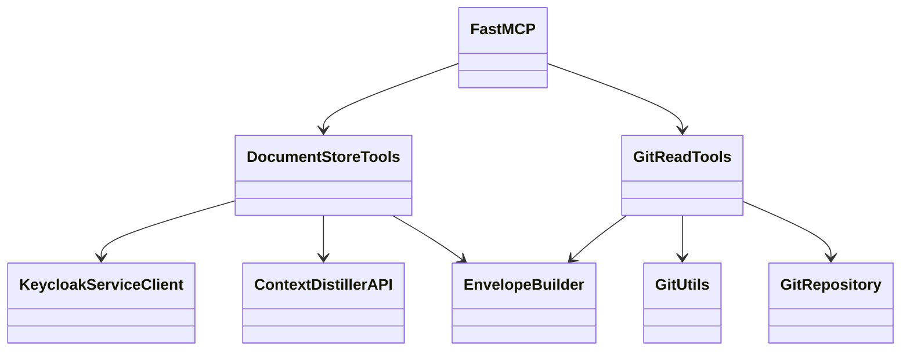

## 6.6 `agent-dispatcher` components

**Purpose**: Poll Orchestrator, execute agents, parse results, and report outcomes.

**Primary internal components**:
- API router: `runs.py`
- Worker: `DispatchWorker`
- Services: `poller.py`, `dispatcher_service.py`, `context_builder.py`, `result_parser.py`, `reporter.py`, `brainstorm_coordinator.py`, `services/runner/*`
- Repository: `AgentRunRepository`

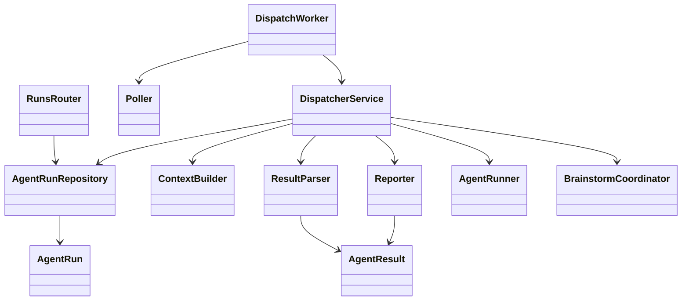

---

## 7. Programming module segregation

This section summarizes the top-level source segregation pattern repeated across most services.

### 7.1 Common backend package pattern

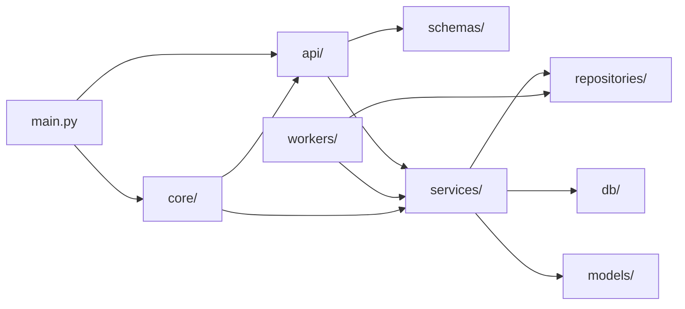

### 7.2 Frontend segregation pattern

Only `user-input-manager` and `ticket-manager` have frontends.

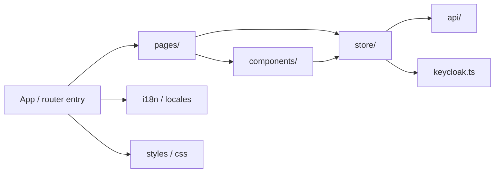

### 7.3 Runtime cross-cutting concerns

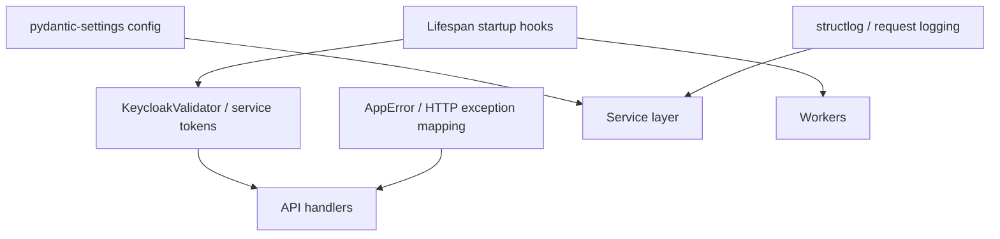

---

## 8. Deployment architecture

## 8.1 Docker Compose deployment diagram

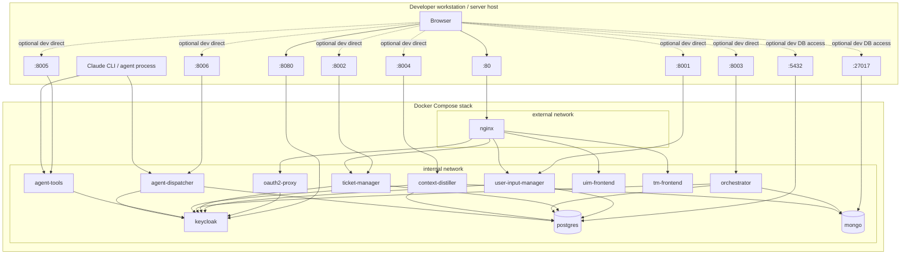

## 8.2 Service startup dependency view

```mermaid
flowchart LR
    PG[(postgres)] --> KC[keycloak]
    KC --> OAUTH[oauth2-proxy]
    PG --> UIM[user-input-manager]
    PG --> TM[ticket-manager]
    PG --> ORCH[orchestrator]
    PG --> DIST[context-distiller]
    PG --> DISP[agent-dispatcher]
    MG[(mongo)] --> ORCH
    MG --> DIST
    KC --> UIM
    KC --> TM
    KC --> ORCH
    KC --> DIST
    KC --> AT[agent-tools]
    KC --> DISP
    UIM --> NGINX[nginx]
    TM --> NGINX
    OAUTH --> NGINX
    UIMF[uim-frontend] --> NGINX
    TMF[tm-frontend] --> NGINX
```

---

## 9. Cross-service design decisions

1. **HTTP boundaries over shared libraries**  
   Cross-service reuse is done by repeating patterns per service, not by importing a shared backend package.

2. **Keycloak as runtime source of truth**  
   All backend services validate Keycloak-issued tokens in runtime; service-to-service auth also flows through Keycloak client credentials.

3. **Per-service state ownership**  
   Each service owns its relational schema; only Orchestrator and Context Distiller additionally own MongoDB documents.

4. **Ticket Manager as system of record for delivery work**  
   Ticket data, assignments, transitions, progress, and events live in `ticket-manager`, even when initiated from other services.

5. **Orchestrator owns workflow logic, not ticket persistence**  
   It decides transitions and assignments, but applies them back through Ticket Manager APIs.

6. **Agent Dispatcher owns execution semantics**  
   Result parsing, brainstorm rounds, orphan-run recovery, and reporting are product behavior, not incidental infrastructure.

7. **Context Distiller owns compressed memory**  
   It is the main source for project memory, ADR retrieval, and project-level agent configuration.

---

## 10. Risks / architectural watchpoints

- **Documentation drift**: some service READMEs still describe legacy local auth and older stacks; prefer compose + current source for runtime truth.
- **Cross-service contract fragility**: because patterns are copy-consistent instead of shared-library based, interface changes must be mirrored carefully across services.
- **Auth split between runtime and tests**: runtime uses Keycloak, while integration tests intentionally use local seeded auth.
- **Dual async patterns**: Orchestrator and Context Distiller use `LISTEN/NOTIFY` plus poll fallback; Agent Dispatcher uses periodic HTTP polling.
- **Two stores for workflow context**: ticket facts live in Ticket Manager, while distilled memory/ADRs/agent config live in MongoDB-backed Context Distiller.

---

## 11. Suggested reading order for implementers

1. `README.md`
2. `specs/004-keycloak-iam-migration/plan.md`
3. `infra/docker-compose.yml`
4. `services/user-input-manager/backend/src/main.py`
5. `services/ticket-manager/backend/src/main.py`
6. `services/orchestrator/src/main.py`
7. `services/context-distiller/src/main.py`
8. `services/agent-tools/src/server.py`
9. `services/agent-dispatcher/src/main.py`
10. `development/run-agents.sh`


